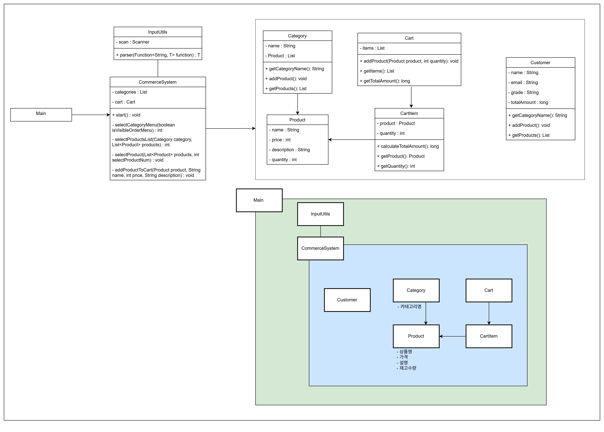

# 콘솔 기반 커머스 시스템

콘솔에서 카테고리별로 상품을 조회하고, 상세 정보를 확인한 뒤 장바구니에 담아 주문할 수 있는 커머스 프로젝트입니다.
재고 관리 시스템을 도입하여 상품의 잔여 수량을 확인하고, 장바구니 상태에 따라 동적으로 메뉴가 변경되는 기능을 구현했습니다.

---

## 구조 (UML 클래스 다이어그램)

---

## 기능

- 상품 카테고리별 목록 조회 (Category, Product)
- 상품 상세 정보 확인 및 재고 체크
- 장바구니 담기 (Cart, CartItem)
  - 입력 수량 검증 (재고보다 많은 수량 입력 시 예외 처리)
- 장바구니 총 금액 계산 (Stream API 활용)
- 동적 메뉴 시스템 (장바구니에 상품이 담겨야 주문 메뉴 활성화)
- 제네릭과 함수형 인터페이스를 활용한 입력 예외 처리

---

## 메뉴

시스템은 카테고리 선택과 상품 상세 메뉴로 나뉩니다. 장바구니 상태에 따라 4, 5번 메뉴가 활성화됩니다.

|  입력 | 메뉴      | 설명                             |
|----:|---------|--------------------------------|
| 1~N | 카테고리 선택 | 해당 카테고리에 포함된 상품 목록을 조회합니다.     |
|   4 | 장바구니 확인 | 장바구니에 담긴 목록과 총 금액을 확인하고 주문합니다. |
|   5 | 주문 취소   | 현재 진행 중인 주문을 취소하고 장바구니를 비웁니다.  |
|   0 | 종료/뒤로가기 | 프로그램을 종료하거나 이전 화면으로 돌아갑니다.     |

---

## 클래스 역할

| 클래스            | 역할                                                            |
|----------------|---------------------------------------------------------------|
| Main           | 프로그램 진입점 및 초기 데이터 주입                                          |
| CommerceSystem | 전체 프로그램 실행 흐름 제어, 동적 메뉴 출력, 사용자 입력 처리                         |
| InputUtils     | Scanner 래핑 / 제네릭 및 함수형 인터페이스(Function)를 이용한 입력 타입 변환 및 재입력 유도 |
| Category       | 상품들을 그룹화하여 리스트로 관리                                            |
| Product        | 상품의 정보(이름, 가격, 설명, 재고)를 관리하는 데이터 모델                           |
| Cart           | 장바구니 로직 수행 (상품 추가, 수량 검증, 총액 계산, 항목 관리)                       |
| CartItem       | 장바구니에 담긴 개별 항목 관리 및 금액 계산                                     |
| Customer       | 사용자 정보 및 등급 관리                                                |

---

### 1) Cart & CartItem (책임의 분리)

- Cart: 전체 장바구니 리스트(List\<CartItem>)를 관리합니다. 상품을 담기 전 product.getQuantity()와 요청 수량을 비교하여 재고 부족시 NoSuchQuantityException을 발생시킵니다.
- CartItem: Cart의 존재를 모르며, 단일 상품(Product)과 구매 수량(quantity)만을 가집니다. 자신의 소계(가격 x 수량)를 계산하는 책임을 가집니다.

---

### 2) Stream API를 활용한 금액 계산

- 장바구니에 담긴 전체 상품의 총 가격을 계산할 때 Java Stream API를 활용했습니다.
- .mapToLong(CartItem::calculateTotalAmount)을 통해 각 상품의 소계를 추출하고, .sum()으로 합산하여 효율적으로 결과를 반환합니다.

---

### 3) 동적 메뉴 시스템

- isVisibleOrderMenu 플래그를 사용하여 장바구니가 비어있을 때는 주문 관련 메뉴(4, 5번)를 숨깁니다.
- 만약 사용자가 숨겨진 메뉴 번호를 강제로 입력할 경우, NoPermissionOrderMenuException을 발생시켜 비정상적인 접근을 차단합니다.

---

### 4) InputUtils (입력 예외 처리 공통화)

- parser(Function\<String, T>) function) 메서드를 통해 입력을 처리합니다.
- 제네릭(\<T>)을 활용하여 정수형(Integer::parseInt) 등 다양한 포맷의 입력을 유연하게 처리합니다.
- NumberFormatException 발생 시 "올바른 숫자를 입력해주시길 바랍니다." 메시지를 출력하고 재입력을 받습니다.

---

### 예외 처리

| 상황                  | 예외 클래스                         | 처리 방식                             |
|---------------------|--------------------------------|-----------------------------------|
| 잘못된 메뉴 번호 입력        | NoSuchMenuNumberException      | "잘못된 메뉴 번호가 입력되었습니다." 출력 후 재입력    |
| 존재하지 않는 상품 번호       | NoSuchProductNumberException   | "입력하신 번호에 해당하는 상품은 존재하지 않습니다." 출력 |
| 장바구니 빈 상태로 접근       | NoPermissionOrderMenuException | "장바구니가 비어있는 상태로 접근할 수 없습니다." 출력   |
| 재고보다 많은 수량 요청       | NoSuchQuantityException        | "상품의 총 재고량보다 많이 담을 수 없습니다." 출력    |
| 장바구니가 빈 상태로 삭제      | NoSuchCartItems                | "장바구니가 현재 비어있습니다." 출력             |

---

## 실행 흐름

1. 메뉴 진입: CommerceSystem이 초기화되고 카테고리 목록을 출력합니다. 
2. 카테고리 선택: 사용자가 원하는 카테고리 번호를 입력하면 해당 상품 리스트를 보여줍니다.
3. 상품 선택 및 검증:
    - 상품 번호를 선택하면 상세 정보(가격, 설명, 잔여 재고)를 출력합니다.
    - 장바구니 추가 여부를 묻고, 수량을 입력받습니다.
    - 입력된 수량이 재고보다 많으면 예외 메시지를 띄우고 담지 않습니다.
4. 장바구니 추가: 정상적인 수량이면 Cart에 저장되고, 메인 메뉴로 돌아갑니다.
    - 이때부터 메인 메뉴에 [주문 관리] 섹션이 활성화됩니다.
5. 반복/종료: 추가 쇼핑을 하거나 0번을 눌러 종료할 때까지 위 과정을 반복합니다.

